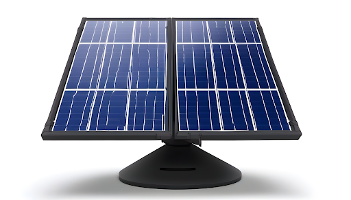

# Project HelioEye

## Overview

HelioEye is an innovative solar tracking and energy monitoring system designed to maximize energy generation from photovoltaic panels. This project aims to address the limitations of stationary solar panels by implementing a dual-axis rotation system, allowing panels to dynamically face the sun for optimal energy production. The system provides real-time energy generation data, periodic predictions, and a user-friendly interface for monitoring and analysis.

## Features

### 1. Solar Panel Rotation

- Dual-axis rotation system to dynamically position solar panels towards the sun.
- Continuous tracking for maximum energy coverage throughout the day.

### 2. Energy Generation Monitoring

- Real-time monitoring of energy generation levels.
- Historical data storage for trend analysis.

### 3. Real-time Data Presentation

- Mobile application for instant access to live energy generation statistics.
- User-friendly interface for easy interpretation of data.

### 4. Statistics Presentation

- Detailed statistical analysis of energy production.
- Graphical representations for better visualization.

### 5. Periodic Data Prediction

- Predictive modeling for weekly and monthly energy generation forecasts.
- Notifications for system performance updates.

### 6. Location-Based Energy Generation Data Showcasing

- Collection of location details for accurate energy generation data.
- Public website portal for showcasing data and promoting solar energy adoption.

## Problem Statement

The current stationary solar panel solutions face limitations in maximizing energy generation throughout the day. Existing systems lack real-time data presentation and periodic predictions, leading to a reluctance among potential customers to invest in solar panels.

## Solution

HelioEye addresses these issues by implementing a dual-axis rotation system for solar panels, providing real-time energy generation monitoring, and offering a portal for location-based data showcasing. The system aims to encourage prospective customers to make informed decisions by providing accurate and accessible information.

## Getting Started

To start using HelioEye, follow these steps:

1. **Installation**: Install the solar tracking module on your photovoltaic panels.
2. **Mobile Application**: Download the mobile application to monitor real-time energy generation.
3. **Portal Access**: Explore the public website portal for location-based energy generation data.

## Future Enhancements

- Integration with smart home systems for automated energy management.
- Expansion of predictive analytics for more accurate long-term forecasts.

## Contributors

- [Kavishka]
- [Dhanushka]
- [Dinuka]
- [Inesha]
- [Supun]

## License

This project is licensed under the [License Name] - see the [LICENSE.md](LICENSE.md) file for details.

---
